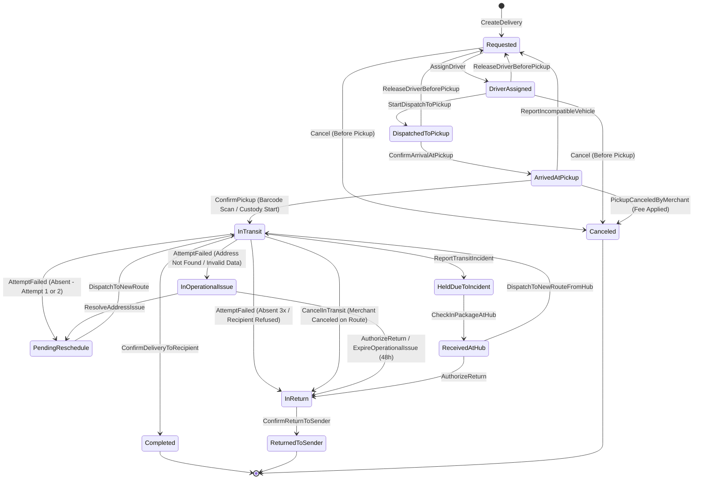
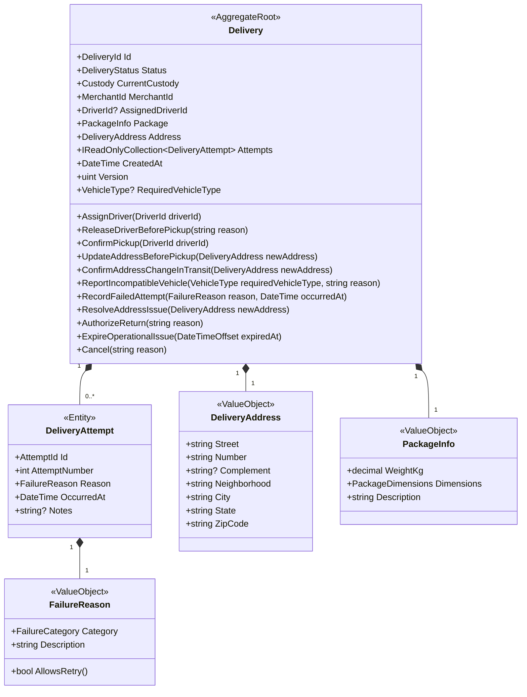

# RouteFlow — Design do Modelo de Domínio e Máquina de Estados

Este documento estabelece o **Modelo Tático de DDD (Domain-Driven Design)** para o módulo central de **Entregas (`Deliveries`)**, traduzindo as decisões operacionais em estruturas de software protegidas.

---

## 1. Linguagem Ubíqua (Glossário Oficial)

Para evitar ambiguidades entre desenvolvedores, negócio e operadores, os seguintes termos são oficiais e devem ser usados rigorosamente no código (classes, métodos, testes, eventos e logs):

| Termo em Português | Termo no Código (C#) | Significado Rigoroso |
| :--- | :--- | :--- |
| **Entrega** | `Delivery` | O Agregado Raiz que governa todo o ciclo de vida e custódia do pacote. |
| **Remetente** | `Merchant` / `Sender` | A loja/empresa que contratou a entrega e de onde o pacote é retirado. |
| **Destinatário** | `Recipient` | A pessoa física ou jurídica que deve receber o pacote. |
| **Custódia** | `Custody` | A posse física e responsabilidade legal sobre o pacote em determinado momento. |
| **Tentativa de Entrega** | `DeliveryAttempt` | Registro fático de uma visita ao endereço de entrega com seu respectivo desfecho. |
| **Fila de Tratativa** | `OperationalIssueQueue` | Estado de exceção para dados inconsistentes que aguarda resolução humana/lojista. |
| **Base / Hub** | `Hub` / `Base` | Ponto físico seguro da RouteFlow para guarda e triagem de mercadorias. |
| **Devolução** | `ReturnToSender` | Processo obrigatório de retorno do pacote ao remetente de origem. |

---

## 2. Máquina de Estados Finita da Entrega (`DeliveryStatus` FSM)

A entrega não possui um status arbitrário. Ela opera como uma **Máquina de Estados Estrita**, onde transições só ocorrem mediante eventos ou comandos válidos:

### Estados Terminais (`Terminal States`):
Uma vez atingido um destes 3 estados, **nenhuma outra transição é permitida**:
1. `Completed`: Pacote entregue com sucesso ao comprador.
2. `ReturnedToSender`: Pacote entregue com sucesso de volta à loja de origem.
3. `Canceled`: Pedido cancelado antes do pacote sair da loja.

---

## 3. O Design Tático do DDD: O Agregado `Delivery`

No DDD tático, agrupamos entidades e objetos de valor sob um **Agregado Raiz (Aggregate Root)**. A raiz é a guardiã única de todas as invariantes e regras de consistência.

---

## 4. Por que Entidade vs. Objeto de Valor (Value Object)?

Esta é uma das distinções mais importantes da Engenharia de Software:

### 4.1. Objetos de Valor (`Value Objects`)
- **Conceito:** Não têm identidade própria (não têm `Id`). São definidos unicamente pelos seus valores. São **100% imutáveis**. Se qualquer campo mudar, é um objeto totalmente novo.
- **Implementação C# (.NET 10):** Modelados com `readonly record struct` ou `record`.
- **Exemplos no nosso sistema:**
  - `DeliveryAddress`: Dois endereços com a mesma rua, número e CEP são idênticos. Mudar de endereço significa atribuir uma nova instância de `DeliveryAddress`, não alterar a propriedade `Street` do endereço antigo.
  - `PackageDimensions` (Altura, Largura, Profundidade).
  - `FailureReason` (Categoria: `RecipientAbsent`, `AddressNotFound`, `RecipientRefused`, `VehicleBreakdown`).
  - `Strongly Typed IDs` (`DeliveryId`, `DriverId`, `MerchantId`): Evita o clássico bug de passar um `Guid` de motorista onde o método esperava um `Guid` de entrega.

### 4.2. Entidades (`Entities`)
- **Conceito:** Têm uma identidade única e contínua que persiste ao longo do tempo, mesmo que seus atributos mudem.
- **Exemplo:** `DeliveryAttempt`. Cada tentativa tem seu identificador único, seu número sequencial (1ª, 2ª, 3ª tentativa) e seu histórico congelado no tempo.

### 4.3. O Agregado Raiz (`Aggregate Root` - `Delivery`)
- Nada de fora pode manipular `DeliveryAttempt` diretamente.
- O código cliente nunca faz: `_attemptRepository.Add(attempt)`.
- O código cliente é obrigado a invocar a raiz: `delivery.RecordFailedAttempt(reason, dateTime)`.
- **Por quê?** Porque é a `Delivery` quem sabe se atingiu o limite de 3 tentativas, se deve transicionar para `AguardandoReagendamento`, `EmTratativaOperacional` ou `EmDevolucao`!

---

## 5. Eventos de Domínio Gerados pelo Agregado

Toda mudança de estado relevante na `Delivery` emite um **Evento de Domínio**:

1. `DeliveryRequestedEvent` (Entrega criada)
2. `DriverAssignedEvent` (Motorista alocado)
3. `PackagePickedUpEvent` (Custódia assumida pela RouteFlow)
4. `DeliveryAttemptFailedEvent` (Tentativa frustrada com motivo)
5. `DeliveryRescheduledEvent` (Nova tentativa agendada)
6. `DeliverySentToOperationalIssueEvent` (Encaminhada para tratativa de endereço)
7. `DeliveryReturnInitiatedEvent` (Início de devolução)
8. `DeliveryCompletedEvent` (Sucesso final)
9. `DeliveryReturnedToSenderEvent` (Devolução confirmada)
10. `DeliveryCanceledEvent` (Cancelamento)
11. `DriverReleasedEvent` (Motorista liberado antes da coleta)
12. `IncompatibleVehicleReportedEvent` (Veículo incompatível no balcão)
13. `DeliveryAddressUpdatedEvent` (Endereço corrigido na tratativa)
14. `OperationalIssueExpiredEvent` (Tratativa expirada após 48 horas)
15. `PickupCanceledByMerchantEvent` (Coleta cancelada no balcão)
