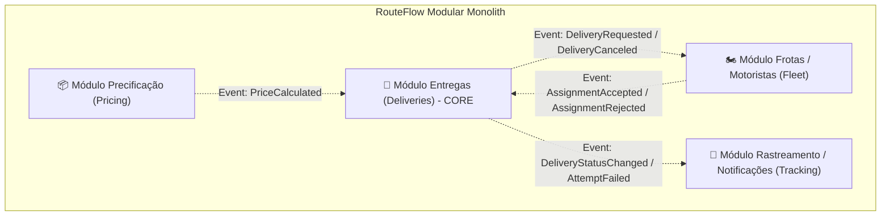
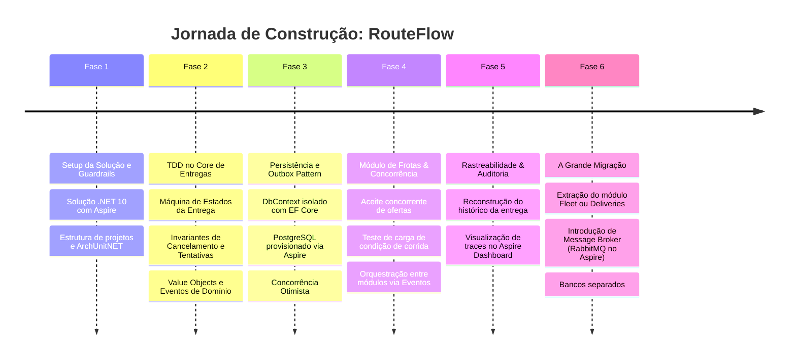

# RouteFlow — Blueprint de Arquitetura: Monolito Modular para Microserviços

## 1. Filosofia: "Monolith First" com Disciplina de Engenharia

Adotar a abordagem **Monolito Modular** antes de ir para microserviços é uma das decisões mais maduras da engenharia de software contemporânea (*MonolithFirst*, Sam Newman / Martin Fowler).

### O Erro Comum
A maioria das tentativas de migração para microserviços falha porque o monolito original era uma "grande bola de lama" (*Big Ball of Mud*) — com entidades misturadas, chamadas diretas a tabelas alheias e dependências circulares.

### Nossa Abordagem
Construiremos um monolito onde os módulos têm o **mesmo isolamento que teriam se fossem microserviços**, mas rodando dentro do mesmo processo .NET. Quando chegar o momento da extração, ela será cirúrgica e de baixo risco.

---

## 2. Delimitação de Bounded Contexts (Módulos)

A partir da análise do [business-context.md](business-context.md), identificamos 4 módulos bem delimitados:



### Detalhamento dos Módulos:

1. **Módulo Entregas (`Deliveries`) — Core Domain**:
   - **Responsabilidade**: Gerenciar o ciclo de vida, máquina de estados e custódia do pacote.
   - **Conceitos centrais**: `Delivery`, `DeliveryAttempt`, `FailureReason`, `ReturnReceipt`.
   - **Invariantes**: Transições de estado restritas, controle de limite de tentativas, regras de cancelamento baseadas em custódia.

2. **Módulo Frotas / Motoristas (`Fleet`) — Supporting Domain**:
   - **Responsabilidade**: Cadastro de motoristas, controle de disponibilidade e alocação de entregas.
   - **Conceitos centrais**: `Driver`, `DriverAvailability`, `DeliveryOffer`.
   - **Invariantes**: Um motorista não pode receber corridas se estiver indisponível; concorrência otimista no aceite de ofertas.

3. **Módulo Precificação (`Pricing`) — Supporting Domain**:
   - **Responsabilidade**: Cálculo de frete com base em peso, volume, distância, urgência e regras contratuais.
   - **Conceitos centrais**: `PriceTable`, `PricingRule`, `Quote`.

4. **Módulo Rastreamento & Notificações (`Tracking`) — Generic Subdomain**:
   - **Responsabilidade**: Linha do tempo pública da entrega, estimativa de chegada e disparo de alertas (SMS/Webhook).
   - **Conceitos centrais**: `DeliveryTimeline`, `PublicTrackingEvent`, `TrackingLink`.

---

## 3. As 4 Regras de Ouro para viabilizar a migração futura

Para que a migração para microserviços seja viável sem reescrever o código de negócio, o monolito seguirá 4 regras invioláveis:

> [!IMPORTANT]
> **Regra 1: Isolamento de Dados (Zero Compartilhamento de Tabelas)**  
> Cada módulo terá seu próprio schema de banco de dados (ex: `deliveries.deliveries`, `fleet.drivers`). **Nenhum módulo pode fazer JOIN ou chave estrangeira (FK) física com tabelas de outro módulo.** Referências entre módulos são feitas apenas por identificadores primitivos/Value Objects (ex: `DriverId`).

> [!IMPORTANT]
> **Regra 2: Comunicação Síncrona Apenas por Interfaces Públicas**  
> Se o módulo de Entregas precisa consultar algo do contexto de Frotas, ele nunca acessa entidades internas desse contexto. A Application depende de uma porta orientada à capacidade (ex: `IDriverAvailabilityGateway`), que pode ser implementada por chamada em processo hoje e por HTTP/gRPC no futuro, sempre traduzindo contratos externos para DTOs imutáveis locais.

> **Regra 3: Comunicação Assíncrona via Eventos de Integração (Sem MediatR)**  
> Eventos que interessam a outros módulos são publicados como `IntegrationEvents`. No início, trafegam via despacho explícito ou canais assíncronos fortemente tipados (`System.Threading.Channels`), sem intermediários mágicos como o MediatR. Na migração, basta trocar o despachante para RabbitMQ/Kafka sem alterar os handlers de negócio.

> [!IMPORTANT]
> **Regra 4: Testes de Arquitetura Automatizados (ArchUnitNET)**  
> Adotaremos testes automatizados na suite de testes que falham a build se alguém tentar referenciar tipos internos de um módulo dentro de outro.

---

## 4. Arquitetura da Solução .NET (Clean Architecture por Módulo com .NET Aspire)

Com a inclusão do **.NET Aspire**, ganhamos orquestração nativa de containers (PostgreSQL, pgAdmin, futuro RabbitMQ) e observabilidade completa (OpenTelemetry Traces, Metrics e Logs) via Aspire Dashboard desde o primeiro dia.

```text
RouteFlow.slnx
├── src/
│   ├── Orchestration/
│   │   ├── RouteFlow.AppHost/                # .NET Aspire AppHost (orquestração de containers e serviços)
│   │   └── RouteFlow.ServiceDefaults/        # .NET Aspire ServiceDefaults (OpenTelemetry, HealthChecks, Resiliência)
│   │
│   ├── SharedKernel/                         # Tipos base compartilhados (Entity, AggregateRoot, IDomainEvent)
│   │
│   ├── Modules/
│   │   ├── Deliveries/                       # Módulo Core
│   │   │   ├── RouteFlow.Deliveries.Domain/         # Entidades puras, Value Objects, Regras (Zero libs)
│   │   │   ├── RouteFlow.Deliveries.Application/    # Use Cases, Commands, Queries, Handlers
│   │   │   ├── RouteFlow.Deliveries.Infrastructure/ # EF Core (DbContext próprio), Repositórios, Mapeamentos
│   │   │   └── RouteFlow.Deliveries.Contracts/      # DTOs públicos e Eventos de Integração expostos
│   │   │
│   │   ├── Fleet/                            # Módulo de Motoristas e Alocação
│   │   │   ├── RouteFlow.Fleet.Domain/
│   │   │   ├── RouteFlow.Fleet.Application/
│   │   │   ├── RouteFlow.Fleet.Infrastructure/
│   │   │   └── RouteFlow.Fleet.Contracts/
│   │   │
│   │   └── Pricing/                          # Módulo de Precificação
│   │
│   └── Bootstrapper/
│       └── RouteFlow.Api/                    # Host ASP.NET Core único (registra módulos e usa ServiceDefaults)
│
└── tests/
    ├── RouteFlow.ArchitectureTests/          # ArchUnitNET garantindo isolamento entre módulos
    ├── RouteFlow.Deliveries.UnitTests/       # TDD nas regras do Core de Domínio
    └── RouteFlow.IntegrationTests/           # Testes de integração com Aspire / Testcontainers
```

---

## 5. Roadmap de Implementação Passo a Passo


